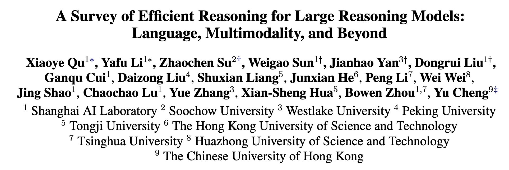
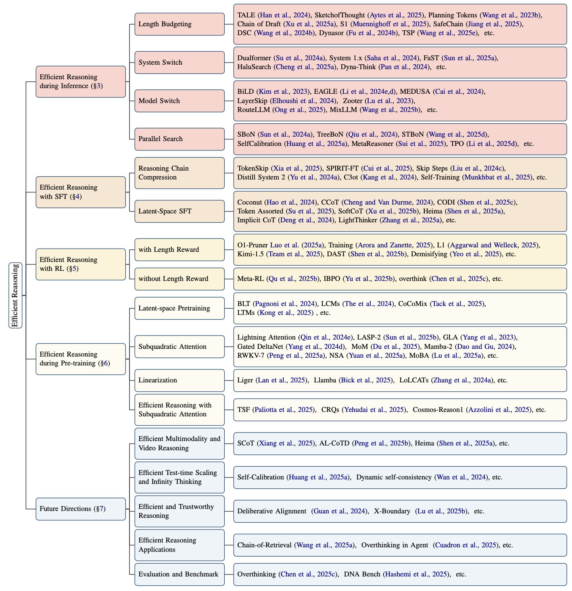

# A Survey of Efficient Reasoning for Large Reasoning Models: Language, Multimodality, and Beyond
[](https://arxiv.org/pdf/2503.21614)  [](https://github.com/XiaoYee/Awesome_Efficient_LRM_Reasoning)
[](https://x.com/suzhaochen0110/status/1905461785693749709?s=46)

[](https://github.com/XiaoYee/Awesome_Efficient_LRM_Reasoning) 
[](https://opensource.org/licenses/MIT)
 

---

## 🔔 News
- [2025-04] We add a new "Model Merge" category in Efficient Reasoning during Inference. It is feasible to be a promising direction. 
- [2025-03] We released our survey "[A Survey of Efficient Reasoning for Large Reasoning Models: Language, Multimodality, and Beyond](https://arxiv.org/abs/2503.21614)". This is the **first survey** for efficient reasoning of **Large Reasoning Models**, covering both language and multimodality.
- [2025-03] We created this repository to maintain a paper list on Awesome-Efficient-LRM-Reasoning.

---




> If you find our survey useful for your research, please consider citing:

```
@article{qu2025survey,
  title={A Survey of Efficient Reasoning for Large Reasoning Models: Language, Multimodality, and Beyond},
  author={Qu, Xiaoye and Li, Yafu and Su, Zhaochen and Sun, Weigao and Yan, Jianhao and Liu, Dongrui and Cui, Ganqu and Liu, Daizong and Liang, Shuxian and He, Junxian and others},
  journal={arXiv preprint arXiv:2503.21614},
  year={2025}
}

```


---




## 🔥 Table of Contents

- [Awesome-Efficient-LRM-Reasoning](#awesome-efficient-lrm-reasoning)
  - [🔔 News](#-news)
  - [🔥 Table of Contents](#-table-of-contents)
  - [📜Content](#content)
    <!-- - [💮 Abstract](#-abstract) -->
    - [👀 Introduction](#-introduction)
  - [🚀 Papers](#-papers)
    - [💭 Efficient Reasoning during Inference](#-efficient-reasoning-during-inference)
      - [Length Budgeting](#length-budgeting)
      - [System Switch](#system-switch)
      - [Model Switch](#model-switch)
      - [Model Merge](#model-merge)
      - [Parallel Search](#parallel-search)
    - [💫 Efficient Reasoning with SFT](#-efficient-reasoning-with-sft)
      - [Reasoning Chain Compression](#reasoning-chain-compression)
      - [Latent-Space SFT](#latent-space-sft)
    - [🧩 Efficient Reasoning with Reinforcement Learning](#-efficient-reasoning-with-reinforcement-learning)
      - [Efficient Reinforcement Learning with Length Reward](#efficient-reinforcement-learning-with-length-reward)
      - [Efficient Reinforcement Learning without Length Reward](#efficient-reinforcement-learning-without-length-reward)
    - [💬 Efficient Reasoning during Pre-training](#-efficient-reasoning-during-pre-training)
      - [Pretraining with Latent Space](#pretraining-with-latent-space)
      - [Subquadratic Attention](#subquadratic-attention)
      - [Linearization](#linearization)
      - [Efficient Reasoning with Subquadratic Attention](#efficient-reasoning-with-subquadratic-attention)
    - [🔖 Future Directions](#-future-directions)
      - [Efficient Multimodal Reasoning and Video Reasoning](#efficient-multimodal-reasoning-and-video-reasoning)
      - [Efficient Test-time Scaling and Infinity Thinking](#efficient-test-time-scaling-and-infinity-thinking)
      - [Efficient and Trustworthy Reasoning](#efficient-and-trustworthy-reasoning)
      - [Building Efficient Reasoning Applications](#building-efficient-reasoning-applications)
      - [Evaluation and Benchmark](#evaluation-and-benchmark)
  - [🎉 Contribution](#-contribution)
    - [Contributing to this paper list](#contributing-to-this-paper-list)
    - [Contributors](#contributors)
  <!-- - [⭐️ Star History](#️-star-history) -->
---

## 📜Content


### 👀 Introduction

In the age of LRMs, we propose that "**Efficiency is the essence of intelligence.**"
Just as a wise human knows when to stop thinking and start deciding, a wise model should know when to halt unnecessary deliberation. 
An intelligent model should manipulate the token economy, i.e., allocating tokens purposefully, skipping redundancy, and optimizing the path to a solution. Rather than naively traversing every possible reasoning path, it should emulate a master strategist, balancing cost and performance with elegant precision.

To summarize, this survey makes the following key contributions to the literature:
- Instead of offering a general overview of LRMs, we focus on the emerging and critical topic of **efficient reasoning** in LRMs, providing an in-depth and targeted analysis.
- We identify and characterize common patterns of reasoning inefficiency, and outline the current challenges that are unique to improving reasoning efficiency in large models.
- We provide a comprehensive review of recent advancements aimed at enhancing reasoning efficiency, structured across the end-to-end LRM development pipeline, from pretraining and supervised fine-tuning to reinforcement learning and inference.


---

## 🚀 Papers


### 💭 Efficient Reasoning during Inference

#### Length Budgeting

- [Scaling llm test-time compute optimally can be more effective than scaling model parameters](https://arxiv.org/abs/2408.03314)
- [Concise thoughts: Impact of output length on llm reasoning and cost](https://arxiv.org/abs/2407.19825)
- [Token-budget-aware llm reasoning](https://arxiv.org/abs/2412.18547)
- [Sketch-of-Thought: Efficient LLM Reasoning with Adaptive Cognitive-Inspired Sketching](https://arxiv.org/abs/2503.05179)
- [Guiding language model reasoning with planning tokens](https://arxiv.org/abs/2310.05707)
- [Chain of Draft: Thinking Faster by Writing Less](https://arxiv.org/abs/2502.18600)
- [s1: Simple test-time scaling](https://arxiv.org/abs/2501.19393)
- [SafeChain: Safety of Language Models with Long Chain-of-Thought Reasoning Capabilities](https://arxiv.org/abs/2502.12025)
- [The impact of reasoning step length on large language models](https://arxiv.org/abs/2401.04925v3)
- [The benefits of a concise chain of thought on problem-solving in large language models](https://arxiv.org/abs/2401.05618)
- [How Well do LLMs Compress Their Own Chain-of-Thought? A Token Complexity Approach](https://arxiv.org/abs/2503.01141)
- [Make every penny count: Difficulty-adaptive self-consistency for cost-efficient reasoning](https://arxiv.org/abs/2408.13457)
- [Efficiently Serving LLM Reasoning Programs with Certaindex](https://arxiv.org/abs/2412.20993)


#### System Switch

- [Dual processes in reasoning?](https://www.sciencedirect.com/science/article/pii/0010027774900171)
- [Dualformer: Controllable Fast and Slow Thinking by Learning with Randomized Reasoning Traces](https://arxiv.org/abs/2410.09918)
- [System-1.x: Learning to Balance Fast and Slow Planning with Language Models](https://arxiv.org/abs/2407.14414)
- [Think More, Hallucinate Less: Mitigating Hallucinations via Dual Process of Fast and Slow Thinking](https://arxiv.org/abs/2501.01306)
- [DynaThink: Fast or slow? A dynamic decision-making framework for large language models](https://arxiv.org/abs/2407.01009)
- [Visual Agents as Fast and Slow Thinkers](https://arxiv.org/abs/2408.08862)

#### Model Switch

- [Closer Look at Efficient Inference Methods: A Survey of Speculative Decoding](https://arxiv.org/abs/2411.13157)
- [Speculative Decoding with Big Little Decoder](https://api.semanticscholar.org/CorpusID:256868484)
- [EAGLE: Speculative Sampling Requires Rethinking Feature Uncertainty](https://arxiv.org/abs/2401.15077)
- [EAGLE-2: Faster Inference of Language Models with Dynamic Draft Trees](https://arxiv.org/abs/2406.16858)
- [Medusa: Simple LLM Inference Acceleration Framework with Multiple Decoding Heads](https://api.semanticscholar.org/CorpusID:267061277)
- [LayerSkip: Enabling Early Exit Inference and Self-Speculative Decoding](https://arxiv.org/abs/2404.16710)
- [RouteLLM: Learning to Route LLMs with Preference Data](https://arxiv.org/abs/2406.18665)
- [MixLLM: Dynamic Routing in Mixed Large Language Models](https://arxiv.org/abs/2502.18482)
- [Routing to the Expert: Efficient Reward-guided Ensemble of Large Language Models](https://arxiv.org/abs/2311.08692)

#### Model Merge

- [Unlocking efficient long-to-short llm reasoning with model merging](https://arxiv.org/abs/2503.20641)

#### Parallel Search

- [Scaling llm test-time compute optimally can be more effective than scaling model parameters](https://arxiv.org/abs/2408.03314)
- [Self-Consistency Improves Chain of Thought Reasoning in Language Models](https://openreview.net/forum?id=1PL1NIMMrw)
- [Let's Verify Step by Step](https://openreview.net/forum?id=v8L0pN6EOi)
- [Fast Best-of-N Decoding via Speculative Rejection](https://arxiv.org/abs/2410.20290)
- [TreeBoN: Enhancing Inference-Time Alignment with Speculative Tree-Search and Best-of-N Sampling](https://api.semanticscholar.org/CorpusID:273502823)
- [Sampling-Efficient Test-Time Scaling: Self-Estimating the Best-of-N Sampling in Early Decoding](https://arxiv.org/abs/2503.01422)
- [Efficient Test-Time Scaling via Self-Calibration](https://arxiv.org/abs/2503.00031)
- [Meta-Reasoner: Dynamic Guidance for Optimized Inference-time Reasoning in Large Language Models](https://arxiv.org/abs/2502.19918)
- [Test-Time Preference Optimization: On-the-Fly Alignment via Iterative Textual Feedback](https://api.semanticscholar.org/CorpusID:275788823)


### 💫 Efficient Reasoning with SFT

#### Reasoning Chain Compression
- [TokenSkip: Controllable Chain-of-Thought Compression in LLMs](https://arxiv.org/abs/2502.12067)
- [Stepwise Perplexity-Guided Refinement for Efficient Chain-of-Thought Reasoning in Large Language Models](https://arxiv.org/abs/2502.13260)
- [Can Language Models Learn to Skip Steps?](https://arxiv.org/abs/2411.01855)
- [Distilling System 2 into System 1](https://arxiv.org/abs/2407.06023)
- [C3oT: Generating Shorter Chain-of-Thought without Compromising Effectiveness](https://arxiv.org/abs/2412.11664)
- [Self-Training Elicits Concise Reasoning in Large Language Models](https://arxiv.org/abs/2502.20122)


#### Latent-Space SFT
- [Training Large Language Models to Reason in a Continuous Latent Space](https://arxiv.org/abs/2412.06769)
- [Compressed Chain of Thought: Efficient Reasoning Through Dense Representations](https://arxiv.org/abs/2412.13171)
- [CODI: Compressing Chain-of-Thought into Continuous Space via Self-Distillation](https://arxiv.org/abs/2502.21074)
- [Token Assorted: Mixing Latent and Text Tokens for Improved Language Model Reasoning](https://arxiv.org/abs/2502.03275)
- [SoftCoT: Soft Chain-of-Thought for Efficient Reasoning with LLMs](https://arxiv.org/abs/2502.12134)
- [Efficient Reasoning with Hidden Thinking](https://arxiv.org/abs/2501.19201)
- [From Explicit CoT to Implicit CoT: Learning to Internalize CoT Step by Step](https://arxiv.org/abs/2405.14838)
- [LightThinker: Thinking Step-by-Step Compression](https://arxiv.org/abs/2502.15589)

  
### 🧩 Efficient Reasoning with Reinforcement Learning

#### Efficient Reinforcement Learning with Length Reward
- [O1-Pruner: Length-Harmonizing Fine-Tuning for O1-Like Reasoning Pruning](https://arxiv.org/abs/2501.12570)
- [Training Language Models to Reason Efficiently](https://arxiv.org/abs/2502.04463)
- [L1: Controlling How Long A Reasoning Model Thinks With Reinforcement Learning](https://www.arxiv.org/abs/2503.04697)
- [Kimi k1.5: Scaling Reinforcement Learning with LLMs](https://arxiv.org/abs/2501.12599)
- [DAST: Difficulty-Adaptive Slow-Thinking for Large Reasoning Models](https://arxiv.org/abs/2503.04472)
- [Demystifying Long Chain-of-Thought Reasoning in LLMs](https://arxiv.org/abs/2502.03373)
- [ThinkPrune: Pruning Long Chain-of-Thought of LLMs via Reinforcement Learning](https://arxiv.org/abs/2504.01296)
  
#### Efficient Reinforcement Learning without Length Reward
- [Optimizing Test-Time Compute via Meta Reinforcement Fine-Tuning](https://arxiv.org/abs/2503.07572)
- [Think Smarter not Harder: Adaptive Reasoning with Inference Aware Optimization](https://arxiv.org/abs/2501.17974)
- [Do NOT Think That Much for 2+3=? On the Overthinking of o1-Like LLMs](https://arxiv.org/abs/2412.21187)

### 💬 Efficient Reasoning during Pre-training

#### Pretraining with Latent Space

- [Byte latent transformer: Patches scale better than tokens](https://arxiv.org/abs/2412.09871)
- [Large Concept Models: Language Modeling in a Sentence Representation Space](https://arxiv.org/abs/2412.08821)
- [LLM Pretraining with Continuous Concepts](https://arxiv.org/abs/2502.08524)
- [Scalable Language Models with Posterior Inference of Latent Thought Vectors](https://arxiv.org/abs/2502.01567)

#### Subquadratic Attention

- [Various Lengths, Constant Speed: Efficient Language Modeling with Lightning Attention](https://arxiv.org/abs/2405.17381)
- [LASP-2: Rethinking Sequence Parallelism for Linear Attention and Its Hybrid](https://arxiv.org/abs/2502.07563)
- [Gated linear attention transformers with hardware-efficient training](https://arxiv.org/abs/2312.06635)
- [Gated Delta Networks: Improving Mamba2 with Delta Rule](https://arxiv.org/abs/2412.06464)
- [MoM: Linear Sequence Modeling with Mixture-of-Memories](https://www.arxiv.org/abs/2502.13685)
- [Transformers are SSMs: Generalized models and efficient algorithms through structured state space duality](https://arxiv.org/abs/2405.21060)
- [RWKV-7 "Goose" with Expressive Dynamic State Evolution](https://arxiv.org/abs/2503.14456)
- [Native sparse attention: Hardware-aligned and natively trainable sparse attention](https://arxiv.org/abs/2502.11089)
- [MoBA: Mixture of Block Attention for Long-Context LLMs](https://arxiv.org/abs/2502.13189)

#### Linearization

- [Liger: Linearizing Large Language Models to Gated Recurrent Structures](https://arxiv.org/abs/2503.01496)
- [Llamba: Scaling Distilled Recurrent Models for Efficient Language Processing](https://arxiv.org/abs/2502.14458)
- [LoLCATs: On Low-Rank Linearizing of Large Language Models](https://arxiv.org/abs/2410.10254)
- [The Mamba in the Llama: Distilling and Accelerating Hybrid Models](https://arxiv.org/abs/2408.15237)

#### Efficient Reasoning with Subquadratic Attention

- [Thinking Slow, Fast: Scaling Inference Compute with Distilled Reasoners](https://arxiv.org/abs/2502.20339)
- [Compositional Reasoning with Transformers, RNNs, and Chain of Thought](https://arxiv.org/abs/2503.01544)
- [Cosmos-Reason1: From Physical Common Sense To Embodied Reasoning](https://arxiv.org/abs/2503.15558v1)


### 🔖 Future Directions

#### Efficient Multimodal Reasoning and Video Reasoning

- [Can Atomic Step Decomposition Enhance the Self-structured Reasoning of Multimodal Large Models?](https://arxiv.org/abs/2503.06252)
- [Skywork R1V: Pioneering Multimodal Reasoning with Chain-of-Thought](https://huggingface.co/Skywork/Skywork-R1V-38B)
  
#### Efficient Test-time Scaling and Infinity Thinking

- [Efficient Test-Time Scaling via Self-Calibration](https://arxiv.org/abs/2503.00031)
- [Dynamic self-consistency: Leveraging reasoning paths for efficient llm sampling](https://arxiv.org/abs/2408.17017)

#### Efficient and Trustworthy Reasoning

- [Deliberative alignment: Reasoning enables safer language models](https://arxiv.org/abs/2412.16339)
- [X-Boundary: Establishing Exact Safety Boundary to Shield LLMs from Multi-Turn Jailbreaks without Compromising Usability](https://arxiv.org/abs/2502.09990)

#### Building Efficient Reasoning Applications

- [Chain-of-Retrieval Augmented Generation](https://arxiv.org/abs/2501.14342)
- [The Danger of Overthinking: Examining the Reasoning-Action Dilemma in Agentic Tasks](https://arxiv.org/abs/2502.08235)

#### Evaluation and Benchmark

- [Do NOT Think That Much for 2+3=? On the Overthinking of o1-Like LLMs](https://arxiv.org/abs/2412.21187)
- [DNA Bench: When Silence is Smarter -- Benchmarking Over-Reasoning in Reasoning LLMs](https://arxiv.org/abs/2503.15793)


---


## Resources

**Reading lists related to Efficient Reasoning**

- [hemingkx/Awesome-Efficient-Reasoning](https://github.com/hemingkx/Awesome-Efficient-Reasoning)
- [Eclipsess/Awesome-Efficient-Reasoning-LLMs](https://github.com/Eclipsess/Awesome-Efficient-Reasoning-LLMs)
- [Hongcheng-Gao/Awesome-Long2short-on-LRMs](https://github.com/Hongcheng-Gao/Awesome-Long2short-on-LRMs)
- [Blueyee/Efficient-CoT-LRMs](https://github.com/Blueyee/Efficient-CoT-LRMs)
- [EIT-NLP/Awesome-Latent-CoT](https://github.com/EIT-NLP/Awesome-Latent-CoT)
- [yzhangchuck/awesome-llm-reasoning-long2short-papers](https://github.com/yzhangchuck/awesome-llm-reasoning-long2short-papers)


## 🎉 Contribution

### Contributing to this paper list

⭐" **Join us in improving this repository!** If you know of any important works we've missed, please contribute. Your efforts are highly valued!   "

### Contributors

<a href="https://github.com/XiaoYee/Awesome_Efficient_LRM_Reasoning/graphs/contributors">
  
</a>

---

<!-- ## ⭐️ Star History

[](https://star-history.com/#XiaoYee/Awesome_Efficient_LRM_Reasoning&Date) -->
